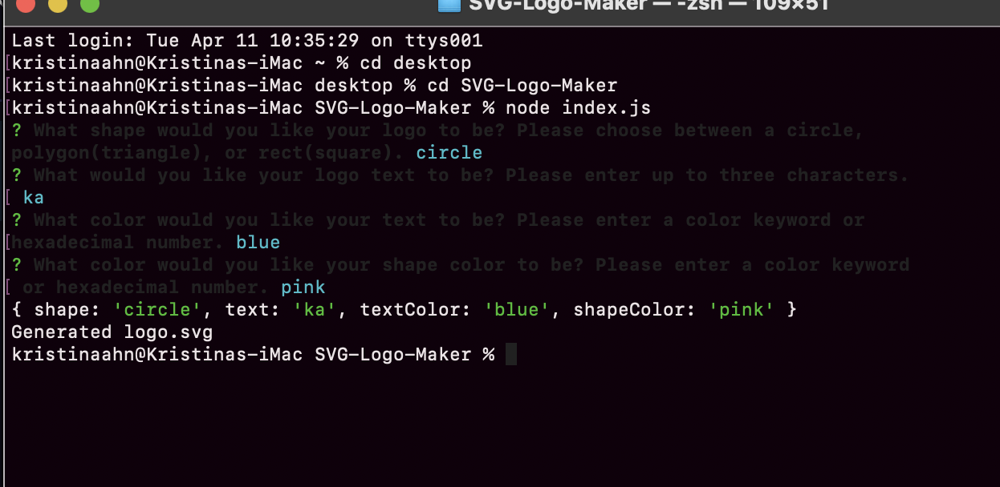

# SVG-Logo-Maker

## Description

This is an SVG logo maker. All you have to do is answer the prompts within the command line and a SVG logo will be created for you! 

## Installation

To use this project you will need to install node.js. If you do not have node.js already installed, here is a link to the installation guide : https://coding-boot-camp.github.io/full-stack/nodejs/how-to-install-nodejs. You will also need install inquirer version 8.2.4 as well as jest. 

## Usage

To use this logo maker, enter into your terminal and ensure all necessary packages are installed(inquirer, node, and jest). Once all packages are installed you can run a test to check if the code is working. If both tests pass, you may type "node index.js" and then answer the prompts. A SVG logo will be create based on the answers you selected within the terminal. 

## Credits

I would like to thank my wonderful tutor Corrado Alfano for helping me finish this project
## License

Please refer to the LICENSE in the repo.

## Assets

## Tests

To run tests, enter `npm run test` into your terminal. You may use jest to ensure that all tests pass. 

## Walkthrough Video

https://watch.screencastify.com/v/j6nd50zQEYoMVXZO6Fu9